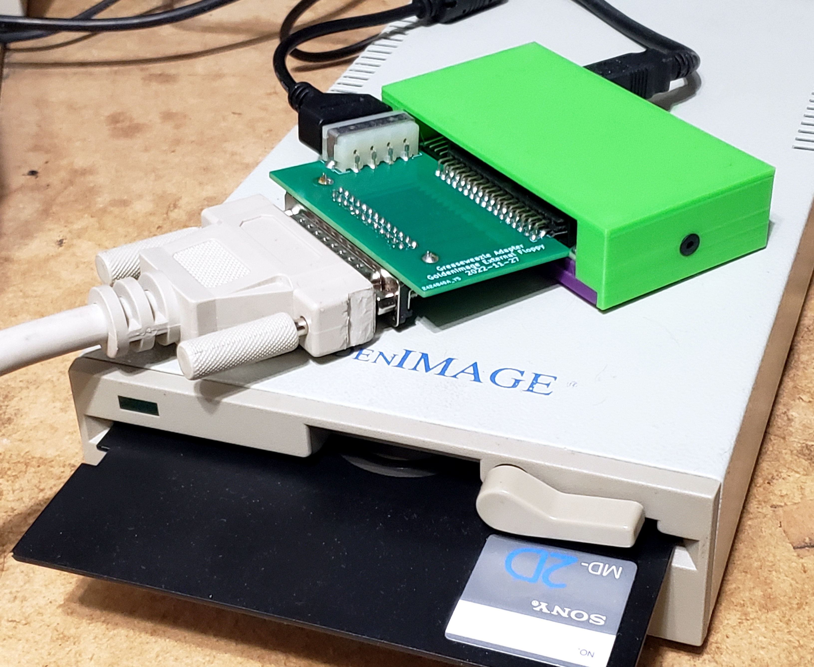

# Greaseweazle External Floppy Adapter

This is a simple PCB design that directly adapts a Greaseweazle floppy interface to a 25 pin (or 37 pin) external floppy drive. The idea was to allow the use of cheap external floppy drives that are missing their pass through hardware card that makes them usable in a vintage system. With the adapter you get an easy to use and robustly  cased floppy drive for use with disk image hardware.  
  
## Assembly  
Take note that the DB25 connector is put on the opposite side of the board than the power and 34 pin IDC connectors. The trace routing would have needed to be flipped to keep them all on top and this was made in a bit of a rush. It would be possible to re-route the PCB to have the connector on top, but all traces would have to cross making the routing much more complicated.